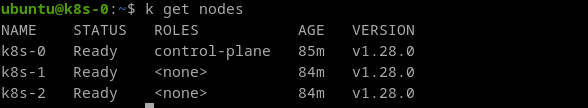
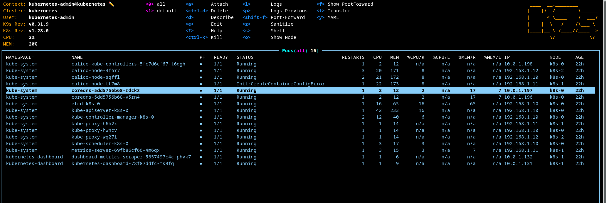

# HomeLab

#Proxmox #Ansible #Terraform #K8s #Kubeadm #k9s

[TOC]


## Proxmox


:eyes: https://www.proxmox.com/en/

Télécharge l'iso de la version **7.4-1**

```shell
wget https://enterprise.proxmox.com/iso/proxmox-ve_7.4-1.iso
```

Vérifier l'intégrité de notre téléchargement

```shell
echo "55b672c4b0d2bdcbff9910eea43df3b269aaab3f23e7a1df18b82d92eb995916 proxmox-ve_7.4-1.iso" | sha256sum -c
```


### Comment créer une clef usb boutable

> on peut aussi utiliser [ventoy](https://www.ventoy.net/en/index.html) pour créer un clef usb avec plusieurs iso bootable

Afficher la liste des supports et disques connectés avec leurs détails.

```shell
df
```

afficher la liste des périphériques connectés pour retrouver les infos de ma clef usb

> 'affichage des partitions du système

```shell
sudo fdisk -l
```

ou plus simplement la commande lsblk

```shell
lsblk
```

formatage du périphérique usb, dans mon cas l'usb est monté dans `/dev/sdb1`

```shell
sudo mkfs.vfat -n 'UTILS' -I /dev/sdb1
```

> (i) pour info: umount notre clef
>
> ```shell
> sudo umount /dev/sdb1
> ```

création de la clef usb bootable avec **dd**

```shell
sudo dd if=./proxmox-ve_7.4-1.iso of=/dev/sdb status=progress
```


>  pour accéder au bios pour mon pc au démarrage il faut cliquer sur la touche **Echap**
>
> vérifier dans l'onglet **Advanced** que l'option **Intel VT**
>
> après avoir fait ces modifications "**saved and exit**"
>
> puis au redémarrage cliquer sur **F12** puis entrer
>
> choisir "**Install Promox VVE (Graphical)**"


### Configuration ssh sur mon poste de travail linux

connexion en ssh au serveur proxmox

créer une paire de clef

```shell
ssh-keygen -t rsa -b 4096 -f ~/.ssh/proxmox -C "root@192.168.1.64"
```

> :information_source: *avec une passphrase si necessaire*
>
> ```shell
> ls -al ~/.ssh
> ```

copier la clef publique sur le serveur proxmox

```shell
ssh-copy-id -i ~/.ssh/proxmox.pub root@192.168.1.64
```

activer l'agent ssh (optional)

```shell
eval $(ssh-agent)
ssh-add ~/.ssh/proxmox
ssh root@192.168.1.64
```


## Iac

### Etape 1: configurer proxmox

#### Comment préparer proxmox à être managé par ansible

```shell
ssh root@192.168.1.64
```

```shell
apt install sudo
```

*(i) depuis le poste de travail avec ansible d'installé*

```shell
cd Proxmox/iac/etape1
ansible-playbook -u root prepare_vm.yml --tags "bootstrap-vm"
```

#### Creation d'un template de vm

```shell
cd Proxmox/iac/etape1
ansible-playbook -u ansible prepare_vm.yml --tags "create_vm_template"
```

### Etape 2: provisionner des vms pour le cluster k8s

se connecter au serveur proxmox


```shell
ssh root@192.168.1.64
```

créer un Role **TerraformProv**

```shell
pveum role add TerraformProv -privs "Datastore.AllocateSpace Datastore.Audit Pool.Allocate Sys.Audit Sys.Console Sys.Modify VM.Allocate VM.Audit VM.Clone VM.Config.CDROM VM.Config.Cloudinit VM.Config.CPU VM.Config.Disk VM.Config.HWType VM.Config.Memory VM.Config.Network VM.Config.Options VM.Migrate VM.Monitor VM.PowerMgmt"
pveum user add terraform-prov@pve --password secure1234
pveum aclmod / -user terraform-prov@pve -role TerraformProv
```

créer un token

```shell
pveum user token add terraform-prov@pve terraform -expire 0 -privsep 0 -comment "Terraform token"
```


:warning:  Avant de continuer il faut ajouter le fichier **`terraform.tfvars`** dans le dossier **Proxmox/iac/etape2**

(i) remplacer 192.168.1.64 par votre ip local

```
proxmox_api_url = "https://192.168.1.64:8006/api2/json"
ssh_key = "votre clef public"
```


Provisionner des vms pour la mise en place d'un cluster k8s avec kubeadm

```shell
cd Proxmox/iac/etape2
export PM_API_TOKEN_ID='terraform-prov@pve!terraform' 
export PM_API_TOKEN_SECRET="[le token généré précédemment]" 
terraform init
terraform plan
terraform apply
```

### Etape 3 : installer cluster k8s (kubeadm)

```shell
cd Kubernetes/iac
ansible-playbook -u ubuntu setup-k8s.yml

```





 :tada: Enjoy!!!!

# Outils

## k9s


[K9S](https://k9scli.io/) c'est un outil écrit en GO, qui permet de gérer un cluster Kubernetes avec tout plein de raccourcis et de couleurs :smiley:. 

### Comment l'installer ?

> sous linux installer [homebrew](https://docs.brew.sh/Installation)

```shell
brew install derailed/k9s/k9s
```

### Comment configurer k9s pour se connecter au cluster k8s ?

Pour interagir avec mon cluster k8s, k9s doit lire les informations du fichier `~/.kube/config`, ce fichier et ce dossier n'existe pas encore sur mon poste de travail.

Tout d'abord je me connecte à ma vm `k8s-0` et je récupère le contenu du fichier `.kube/config` (context admin qu'on pourra changer par la suite...), puis 

sur mon pc de travail je crée un dossier `.kube` et dans ce dossier j'ajoute un fichier `config` et je colle le contenue que je viens de copier et voilà!!! :tada: 

Lancer k9s dans une invite de commande...



Vous aurez aussi besoin d'installer le cli `kubectl`  sur votre poste de travail [[doc](https://kubernetes.io/fr/docs/tasks/tools/install-kubectl/)]

```shell
# Debian/ubuntu
sudo apt-get update && sudo apt-get install -y apt-transport-https
curl -s https://packages.cloud.google.com/apt/doc/apt-key.gpg | sudo apt-key add -
echo "deb https://apt.kubernetes.io/ kubernetes-xenial main" | sudo tee -a /etc/apt/sources.list.d/kubernetes.list
sudo apt-get update
sudo apt-get install -y kubectl
```


*(i) par exemple dans k9s lorsque vous voulez editer le manifest d'un pod*

# Index

## Comment ajouter ajouter un espace de stockage

:eyes: https://nubcakes.net/index.php/2019/03/05/how-to-add-storage-to-proxmox/

## Terraform

:eyes: https://developer.hashicorp.com/terraform/install

