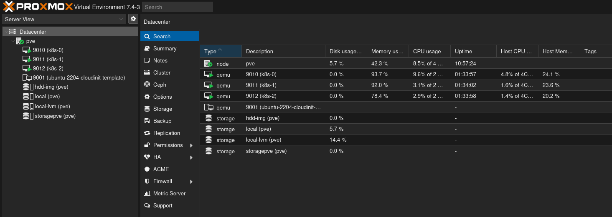

# :construction: (readme under construction) HomeLab 

#Proxmox #Ansible #Terraform


## Proxmox



:eyes: https://www.proxmox.com/en/

Download the ISO for version **8.3-1**:

```shell
pve_version="8.3-1"
pve_iso="proxmox-ve_$pve_version.iso"
pve_iso_checksum=$(curl -sL https://enterprise.proxmox.com/iso/SHA256SUMS | grep $pve_iso | awk '{print $1}')
wget "https://enterprise.proxmox.com/iso/$pve_iso"
```

Verify the integrity of the download:

```shell
echo "$pve_iso_checksum $pve_iso" | sha256sum -c
```


### How to Create a Bootable USB Drive

> You can also use [Ventoy](https://www.ventoy.net/en/index.html) to create a bootable USB drive with multiple ISO images.

List the connected storage devices and drives with details:

```shell
df
```

To find information about your USB drive, list the connected devices:

> This command displays the system's partitions:

```shell
sudo fdisk -l
```

Or simply use the `lsblk` command:

```shell
lsblk
```

Format the USB drive (in this case, the USB is mounted at `/dev/sdb1`):

```shell
sudo mkfs.vfat -n 'UTILS' -I /dev/sdb1
```

> (i) Note: If necessary, unmount the USB drive:
>
> ```shell
> sudo umount /dev/sdb1
> ```

Create the bootable USB drive using **dd**:

```shell
sudo dd if=./$pve_iso of=/dev/sdb status=progress
```


>  To access the BIOS on my PC during startup, press the **Escape** key.
>
> In the **Advanced** tab, ensure the **Intel VT** option is enabled.
>
> After making these changes, select "**Save and Exit**."
>
> Upon reboot, press **F12** and then hit Enter.
>
> Select "**Install Proxmox VVE (Graphical)**."


### SSH Configuration on My Linux Workstation

Connect to the Proxmox server via SSH and create an SSH key pair:

```shell
ssh-keygen -t ed25519 -f ~/.ssh/proxmox -C "root@192.168.1.180"
```

> :information_source: *Include a passphrase if necessary.*
>
> ```shell
> ls -al ~/.ssh
> ```

Copy the public key to the Proxmox server:

```shell
ssh-copy-id -o PreferredAuthentications=password -o PubkeyAuthentication=no -i ~/.ssh/proxmox.pub root@192.168.1.180
```

(Optional) Activate the SSH agent:

```shell
eval $(ssh-agent)
ssh-add ~/.ssh/proxmox
ssh root@192.168.1.180
```
# Dependances
- `ansible`
- `ssh`
- `yq`
```shell
sudo apt install yq
```
## Infrastructure as Code (IaC)

### Configure Proxmox

#### Preparing Proxmox to be Managed by Ansible

```shell
ssh root@192.168.1.180
```

```shell
apt install sudo
```

(i) From the workstation with Ansible installed:

To execute this playbook, you need to use the root user of the target machine. Specifying the `--tags "security_ssh_hardening"` tag will allow us to apply specific tasks that will enhance the security of the server access and create a dedicated user for running Ansible playbooks.

(i) Beforehand you need to create your own secret files

```shell
cd proxmox/ansible
mkdir -p ./.secrets/
echo $(pwgen 100 1) > ./.secrets/.vault_password
cat > ./.secrets/config.yml <<EOF
gen_password: $(pwgen 64 1)
ssh_key_file: $(pwgen 100 1)
EOF
```

```shell
sudo -i
cat >> /etc/hosts <<EOF
192.168.1.180    proxmox.local
EOF
exit
```

```shell
ansible-playbook -u root playbook.yml --tags "security_ssh_hardening"
```
Adapt the cloud-init image checksum to the current

```shell 
../../update_checksums.sh

# Get checksums from remote
# ubuntu_checksum=$(curl -sL https://cloud-images.ubuntu.com/releases/22.04/release/SHA256SUMS | grep ubuntu-22.04-server-cloudimg-amd64-disk-kvm.img | awk '{print $1}')
# debian_checksum=$(curl -sL https://cloud.debian.org/images/cloud/bookworm/latest/SHA512SUMS | grep debian-12-genericcloud-amd64.qcow2 | awk '{print $1}')
# opensuse_checksum=$(curl -sL https://download.opensuse.org/distribution/leap/15.6/appliances/openSUSE-Leap-15.6-Minimal-VM.x86_64-kvm-and-xen.qcow2.sha256 | grep openSUSE-Leap-15.6-Minimal-VM.x86_64-kvm-and-xen.qcow2 | awk '{print $1}')

# Replace with sed only if there is one cloud init image template alone (not working for several templates)
# sed -i'.bak' 's/url_checksum:.*/url_checksum: sha256:'$checksum'/' roles/configure/vars/main/cloud_init_and_template.yml
```
Create an SSH key pair for vm :

```shell
ssh-keygen -t ed25519 -f ~/.ssh/id_vm_proxmox_rsa.pub -C "ansible@192.168.1.180"
```

Now we can execute all the tasks in this playbook.

```shell
ansible-playbook playbook.yml
```

:warning: **<u>Take the time to fully understand what this playbook does, as well as the .sh scripts located in the files folder, before executing it.</u>**


### Provision one or more VMs

You will need to create the **terraform.tfvars** file and add your own values for the following variables.

```properties
# # Proxmox API credentials
pm_api_token_id = "terraform-prov@pve!terraform"
pm_api_url      = "https://proxmox.local:8006/api2/json/"

vm_count        = 1

vm_template     = "ubuntu-2204-cloudinit-template"  # Name of the Proxmox template to clone for the VM
vm_disk0_size   = "40G"        # Size of the primary disk attached to the VM (e.g., '40G' for 40 gigabytes)
vm_cpu_cores    = 2            # Number of CPU cores assigned to the VM
vm_memory       = 4096         # Amount of RAM assigned to the VM (in MB)
vm_name_prefix  = "test-vm"
vm_ip_start     = 10
```

```shell
cd ../terraform
cat > terraform.tfvars <<EOF
# # Proxmox API credentials
pm_api_token_id = $(ssh root@192.168.1.180 -t cat .terraform_token | jq .\"full-tokenid\")
pm_api_token_secret = $(ssh root@192.168.1.180 -t cat .terraform_token | jq ."value")
pm_api_url      = "https://proxmox.local:8006/api2/json/"

vm_count        = 3

vm_template     = "ubuntu-2204-cloudinit-template"  # Name of the Proxmox template to clone for the VM
vm_disk0_size   = "40G"        # Size of the primary disk attached to the VM (e.g., '40G' for 40 gigabytes)
vm_cpu_cores    = 2            # Number of CPU cores assigned to the VM
vm_memory       = 4096         # Amount of RAM assigned to the VM (in MB)
vm_name_prefix  = "vm"
vm_ip_start     = 10
vm_target_node  = "homebox"
EOF
```

Apply this Terraform job to provision one or more VMs on the Proxmox server.

*(i) The token was generated via the Ansible playbook and is available on the Proxmox server in the root home directory. You can display it using the command `cat .terraform_token`. Once you have copied and secured it, you are free to delete it.*

```shell
export TF_VAR_pm_api_token_id=$(ssh root@192.168.1.180 -t cat .terraform_token | jq .\"full-tokenid\")
export TF_VAR_pm_api_token_secret=$(ssh root@192.168.1.180 -t cat .terraform_token | jq ."value")
terraform init
terraform plan
terraform apply
```
