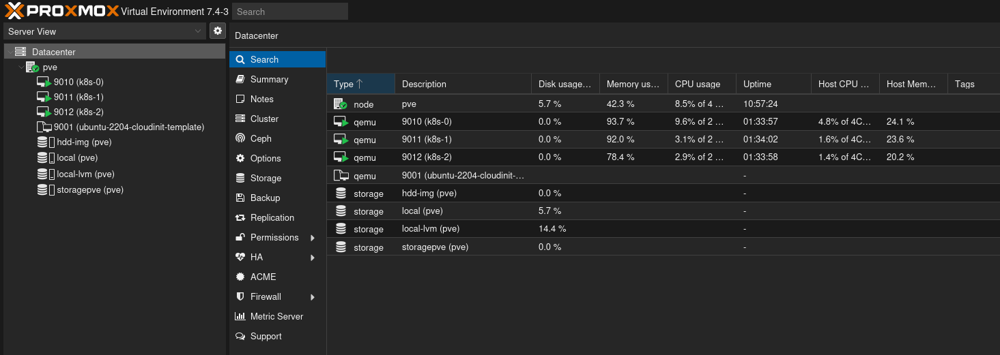

# HomeLab

#Proxmox #Ansible #Terraform #K8s #Kubeadm #k9s

[TOC]


## Proxmox



:eyes: https://www.proxmox.com/en/

Download the ISO for version **7.4-1**:

```shell
wget https://enterprise.proxmox.com/iso/proxmox-ve_7.4-1.iso
```

Verify the integrity of the download:

```shell
echo "55b672c4b0d2bdcbff9910eea43df3b269aaab3f23e7a1df18b82d92eb995916 proxmox-ve_7.4-1.iso" | sha256sum -c
```


### How to Create a Bootable USB Drive

> You can also use [Ventoy](https://www.ventoy.net/en/index.html) to create a bootable USB drive with multiple ISO images.

List the connected storage devices and drives with details:

```shell
df
```

To find information about your USB drive, list the connected devices:

> This command displays the system's partitions:

```shell
sudo fdisk -l
```

Or simply use the `lsblk` command:

```shell
lsblk
```

Format the USB drive (in this case, the USB is mounted at `/dev/sdb1`):

```shell
sudo mkfs.vfat -n 'UTILS' -I /dev/sdb1
```

> (i) Note: If necessary, unmount the USB drive:
>
> ```shell
> sudo umount /dev/sdb1
> ```

Create the bootable USB drive using **dd**:

```shell
sudo dd if=./proxmox-ve_7.4-1.iso of=/dev/sdb status=progress
```


>  To access the BIOS on my PC during startup, press the **Escape** key.
>
> In the **Advanced** tab, ensure the **Intel VT** option is enabled.
>
> After making these changes, select "**Save and Exit**."
>
> Upon reboot, press **F12** and then hit Enter.
>
> Select "**Install Proxmox VVE (Graphical)**."


### SSH Configuration on My Linux Workstation

Connect to the Proxmox server via SSH and create an SSH key pair:

```shell
ssh-keygen -t rsa -b 4096 -f ~/.ssh/proxmox -C "root@192.168.1.64"
```

> :information_source: *Include a passphrase if necessary.*
>
> ```shell
> ls -al ~/.ssh
> ```

Copy the public key to the Proxmox server:

```shell
ssh-copy-id -i ~/.ssh/proxmox.pub root@192.168.1.64
```

(Optional) Activate the SSH agent:

```shell
eval $(ssh-agent)
ssh-add ~/.ssh/proxmox
ssh root@192.168.1.64
```


## Infrastructure as Code (IaC)

### Configure Proxmox

#### Preparing Proxmox to be Managed by Ansible

```shell
ssh root@192.168.1.64
```

```shell
apt install sudo
```

(i) From the workstation with Ansible installed:

To execute this playbook, you need to use the root user of the target machine. Specifying the `--tags "security_ssh_hardening"` tag will allow us to apply specific tasks that will enhance the security of the server access and create a dedicated user for running Ansible playbooks.

```shell
cd proxmox/ansible
ansible-playbook -u root playbook.yml --tags "security_ssh_hardening"
```

Now we can execute all the tasks in this playbook.

```shell
ansible-playbook playbook.yml
```

:warning: **<u>Take the time to fully understand what this playbook does, as well as the .sh scripts located in the files folder, before executing it.</u>**


### Provision one or more VMs

You will need to create the **terraform.tfvars** file and add your own values for the following variables.

```properties
# # Proxmox API credentials
pm_api_token_id = "terraform-prov@pve!terraform"
pm_api_url      = "https://proxmox.local:8006/api2/json/"

vm_count        = 1

vm_template     = "ubuntu-2204-cloudinit-template"  # Name of the Proxmox template to clone for the VM
vm_disk0_size   = "40G"        # Size of the primary disk attached to the VM (e.g., '40G' for 40 gigabytes)
vm_cpu_cores    = 2            # Number of CPU cores assigned to the VM
vm_memory       = 4096         # Amount of RAM assigned to the VM (in MB)
vm_name_prefix  = "test-vm"
vm_ip_start     = 10
```

Apply this Terraform job to provision one or more VMs on the Proxmox server.

*(i) The token was generated via the Ansible playbook and is available on the Proxmox server in the root home directory. You can display it using the command `cat .terraform_token`. Once you have copied and secured it, you are free to delete it.*

```shell
cd proxmox/terraform
cd Proxmox/iac/etape2
export PM_API_TOKEN_ID='terraform-prov@pve!terraform' 
export PM_API_TOKEN_SECRET="[le token généré précédemment]" 
terraform init
terraform plan
terraform apply
```


### Install the K8s Cluster (Kubeadm) (:construction: This chapter is a work in progress.)

```shell
cd Kubernetes/iac
ansible-playbook -u ubuntu setup-k8s.yml

```


 :tada: Enjoy!!!!

# Outils​ :construction:

## k9s


[K9S](https://k9scli.io/) is a tool written in GO that allows you to manage a Kubernetes cluster with lots of shortcuts and colors. :smiley:

### How to Install It?

> On Linux, install [Homebrew](https://docs.brew.sh/Installation):

```shell
brew install derailed/k9s/k9s
```

### How to Configure k9s to Connect to the K8s Cluster?

To interact with your K8s cluster, k9s needs to read the `~/.kube/config` file. This file and directory do not yet exist on your workstation.

First, connect to your `k8s-0` VM and retrieve the contents of the `.kube/config` file (admin context, which can be changed later). Then, on your workstation, create a `.kube` directory, add a `config` file inside, and paste the content you copied. Done! :tada:

Launch k9s from the command line...


You will also need to install the `kubectl` CLI on your workstation  [[doc](https://kubernetes.io/fr/docs/tasks/tools/install-kubectl/)]

```shell
# Debian/ubuntu
sudo apt-get update && sudo apt-get install -y apt-transport-https
curl -s https://packages.cloud.google.com/apt/doc/apt-key.gpg | sudo apt-key add -
echo "deb https://apt.kubernetes.io/ kubernetes-xenial main" | sudo tee -a /etc/apt/sources.list.d/kubernetes.list
sudo apt-get update
sudo apt-get install -y kubectl
```


(i) For example, in k9s, when you want to edit a pod's manifest.


## :facepunch: Contribution

Contributions are welcome! If you'd like to contribute, please follow these steps:

1. **Fork the repository** to your own GitHub account.
2. **Clone your fork** locally:

```shell
git clone https://github.com/yourusername/my-homelab.git
cd manage-repo
```

**Create a new branch** for your feature or bug fix:

```shell
git checkout -b my-new-feature
```

**Make your changes** and commit them with a clear message:

```shell
git commit -m "Add new feature"
```

**Push your branch** to your fork:

1. ```shell
   git push origin my-new-feature
   ```

2. **Open a Pull Request** on the original repository and describe your changes.

By following these steps, you can help improve the project for everyone!


# Index

## How to Add a Storage Space

:eyes: https://nubcakes.net/index.php/2019/03/05/how-to-add-storage-to-proxmox/

## Terraform

:eyes: https://developer.hashicorp.com/terraform/install
